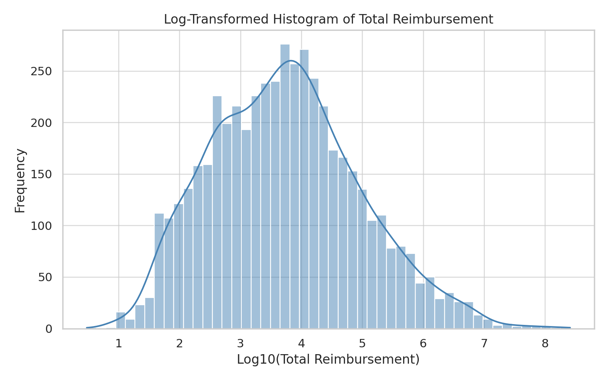
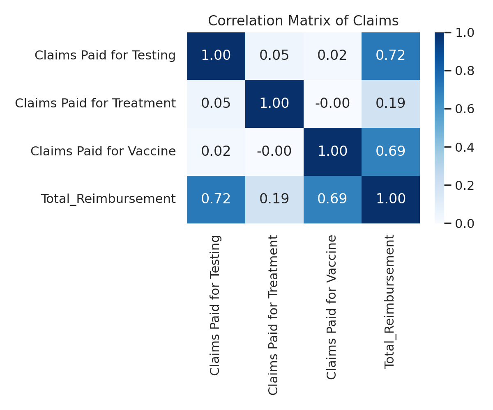
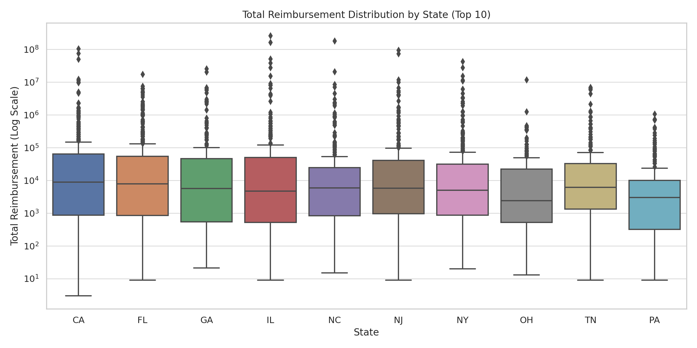

# 🏥 Healthcare Provider Reimbursement Amounts Using Predictive Analytics

## 📌 Overview
This project focuses on predicting healthcare reimbursement amounts using machine learning and identifying high-reimbursement cases that may signal potential fraud. By using regression and classification models, this solution supports healthcare providers with better financial forecasting and proactive fraud detection.

---

## 🎯 Business Problem
Healthcare providers face challenges in reimbursement variability and undetected fraudulent claims, leading to cash flow issues and inefficiencies. Accurate predictions can:
- Reduce operational disruptions
- Support resource allocation
- Identify suspicious claims

According to the NHCAA, healthcare fraud accounts for over **$68 billion** annually.

---

## 🔍 Analytical Approach
We defined the problem as two tasks:

### 🧮 Regression Task:
- Predict `Total Reimbursement` based on claims for testing, treatment, and vaccines.

### 🕵️ Classification Task:
- Flag providers with "High" (top 5%) reimbursement for further review.
- Based on the 95th percentile threshold—a commonly used fraud detection benchmark.

---

## 📊 Exploratory Data Analysis

### 1. 📉 Histogram: Log-Transformed Total Reimbursement
Most providers receive low reimbursements. A few outliers show extremely high values.

---

### 2. 🔥 Correlation Matrix
Claims for testing, treatment, and vaccines are moderately correlated with each other and the total reimbursement.

---

### 3. 🗺️ Reimbursement by State (Top 10 States)
Clear regional disparities, with some states showing outlier reimbursements.

---

## 🧹 Preprocessing Summary
- ✅ Feature Engineering: Created `Total_Reimbursement` from individual claim categories.
- ✅ Encoding: Label encoding for state and city.
- ✅ Scaling: StandardScaler applied to numerical data.
- ✅ Class Balancing: Used **SMOTE** to address class imbalance in classification.
- ✅ Validation: 80/20 train-test split with 5-fold cross-validation.

---

## 🤖 Models & Performance

| Model              | R² Score | MAE      | Classification Accuracy | Precision | Recall |
|-------------------|----------|----------|--------------------------|-----------|--------|
| **Logistic Regression** | —       | —        | 96.99%                   | 97.2%     | 95.8%  |
| **Decision Tree**       | 0.72     | 12,850   | 95.5%                    | 96.1%     | 94.3%  |
| **Random Forest**       | 0.85     | 9,200    | 97.5%                    | 98.0%     | 96.8%  |

⭐ **Best Model:** Random Forest, due to higher generalization and best regression + classification accuracy.

---

## 📈 Model Insights
- Logistic Regression: Interpretable but lacks complex pattern detection.
- Decision Tree: Good for interpretation but overfits.
- Random Forest: Excellent accuracy and handles complex features well.
- Overfitting mitigated using cross-validation and regularization.

---

## 🧠 Key Learnings
- Fraud is often hidden in the top 5% reimbursements—monitoring these is critical.
- Geographic differences suggest region-specific billing practices.
- Data skewness and outliers are vital to understand before model deployment.

---

## 🚀 Future Work
- ✅ Use SHAP or LIME to explain model outputs.
- ✅ Test on larger and more diverse datasets.
- ✅ Integrate external factors (e.g. socioeconomic or patient demographic data).
- ✅ Deploy using Flask or FastAPI as real-time fraud detection service.

---
